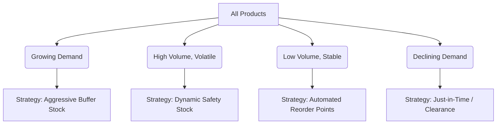

#  Sales Forecasting & Demand Intelligence System

Welcome to the **XYLOFY AI Demand Intelligence System**. This system is designed to help retail, e-commerce, and logistics operations answer a critical business question: **"How much of each product will we sell next month, and how should we manage our inventory to maximize profit?"**

This repository contains the full end-to-end intelligence system, including the data analysis research, the predictive models, and an interactive business dashboard.

---

##  Project Overview & Business Value

Every commerce business faces two costly risks:
*   **Understocking (Stockouts):** Running out of popular items, leading to lost sales and disappointed customers.
*   **Overstocking (Capital Lockup):** Holding too much inventory, which wastes warehouse space, degrades over time, and ties up cash flow.

This system solves this problem by combining historical sales data with advanced forecasting and clustering models to provide **automated demand planning, anomaly detection, and stocking strategies**.

The workspace contains the following files:
*   **[app.py](file:///c:/XYlofy%20AI/End-to-EndSalesForecasting&DemandIntelligenceSystem/app.py):** The main interactive dashboard that visualizes all demand intelligence.
*   **[analysics.ipynb](file:///c:/XYlofy%20AI/End-to-EndSalesForecasting&DemandIntelligenceSystem/analysics.ipynb):** The research notebook where models were compared and developed.
*   **[requirements.txt](file:///c:/XYlofy%20AI/End-to-EndSalesForecasting&DemandIntelligenceSystem/requirements.txt):** The package dependencies required to run the application.
*   **[SuperStore.csv](file:///c:/XYlofy%20AI/End-to-EndSalesForecasting&DemandIntelligenceSystem/SuperStore.csv):** The primary historical transaction database used to power the system.

---

##  The Demand Intelligence Dashboard

The dashboard is built to be used directly by **inventory planners, finance leaders, and operations managers**. It is split into four intuitive tabs:

### 1. Sales Overview Dashboard
Provides a birds-eye view of historical sales performance.
*   **What it does:** Allows you to filter data by region and product category.
*   **Key Metrics:** Displays Total Revenue, Average Monthly Sales, Total Order Count, and the Top-Selling Product Sub-Category.
*   **Visual Insights:** Displays annual sales growth and monthly sales trends side-by-side to easily identify seasonal patterns (e.g., Q4 spikes).

### 2. Demand Forecast Explorer
Predicts future sales up to 3 months ahead.
*   **What it does:** Select any product category or geographical region, choose a forecast horizon (1, 2, or 3 months ahead), and view future sales expectations.
*   **Key Metrics:** Shows the model's accuracy on past test data (Mean Absolute Error and Percentage Error) so you know exactly how reliable the prediction is.
*   **Visual Insights:** Graphs historical sales, actual recent sales, and the statistical forecast curve with shaded safety zones.

### 3. Weekly Anomaly Report
An early warning system that flags unusual sales events.
*   **What it does:** Scans weekly transaction logs to find sudden spikes (which might indicate a bulk order or marketing success) or sudden drops (suggesting supply chain issues or data loss).
*   **Key Metrics:** Flags weeks exceeding standard deviation thresholds or showing abnormal volume changes.
*   **Visual Insights:** Displays a timeline mapping every anomaly, alongside a detailed table showing the date, the sales value, the percentage change, and the severity score.

### 4. Product Demand Segments
Automatically groups product categories based on how customers order them.
*   **What it does:** Uses AI to group products based on four characteristics: overall sales volume, growth rate over time, volatility (unpredictability), and average order size.
*   **Key Metrics:** Maps all sub-categories (like Chairs, Paper, Machines, etc.) on a 2D map to show how close their demand profiles are.
*   **Stocking Strategy:** Provides actionable replenishment advice for each group (see the strategy table below).

---

##  Model Performance & Selection

During the research phase in the [analysics.ipynb](file:///c:/XYlofy%20AI/End-to-EndSalesForecasting&DemandIntelligenceSystem/analysics.ipynb) notebook, three different types of forecasting models were evaluated on the final 3 months of historical data (holdout test set):

| Model Type | Key Advantage | Average Prediction Error (MAE) | Average % Error (MAPE) | Best For |
| :--- | :--- | :--- | :--- | :--- |
| **XGBoost (Machine Learning)** | Highly flexible; captures complex interactions. | **$18,923.67** | **19.38%** (Best) | Complex, multi-variable patterns |
| **SARIMA (Statistical)** | Highly reliable; models seasonality and trends mathematically. | **$19,954.91** | **21.17%** | Steady datasets with clear seasonality |
| **Facebook Prophet (Time-Series)** | Excellent at capturing custom holidays and yearly effects. | **$22,643.97** | **20.89%** | Holiday spikes and trend shifts |

> [!NOTE]
> **Why the Dashboard Uses SARIMA:** While XGBoost achieved a slightly lower percentage error, SARIMA was selected to power the segment-level forecasts in the dashboard. SARIMA is extremely stable when broken down into smaller subsets (like specific regions or categories) and does not require complex feature re-calculation, making it highly robust for live inventory planning.

---

##  Anomaly Detection Methods

The system uses two complementary mathematical methods to detect unusual sales behavior:

1.  **Rolling Z-Score (Trend-Aware):**
    *   *How it works:* It compares each week's sales to the average of the surrounding 8 weeks. If sales deviate by more than **2.0 standard deviations**, they are flagged.
    *   *Benefit:* It automatically adjusts for long-term business growth. If your business is twice as large as last year, it won't flag normal large numbers as anomalies.
2.  **Isolation Forest (AI Pattern Finder):**
    *   *How it works:* It looks at a combination of weekly sales volume and the Week-over-Week percentage change. It isolates values that look completely distinct from the rest of the dataset.
    *   *Benefit:* Excellent for catching sudden, massive spikes or drops that occur regardless of the season.

---

##  Demand Segmentation & Stocking Strategy

Products are segmented into four clusters. Planners can use these groupings to automate warehouse operations:



| Demand Segment | Examples (Sub-Categories) | Key Characteristics | Inventory & Stocking Action Plan |
| :--- | :--- | :--- | :--- |
| **Growing Demand** | Copiers | Extreme annual growth (~80%) and high volume. | **Aggressive Buffer:** Establish a large safety stock buffer, secure bulk supplier agreements, and monitor capacity constraints. |
| **High Volume, Volatile** | Accessories, Binders, Chairs, Phones, Storage, Tables | High revenue contributors but highly unpredictable order sizes. | **Dynamic Safety Stock:** Maintain high safety stocks to cover unexpected spikes. Share sales pipeline forecasts with suppliers. |
| **Low Volume, Stable** | Appliances, Bookcases, Art, Paper, Envelopes, Labels | Low sales volume but highly stable and predictable week-to-week. | **Automated Reorder Points:** Maintain minimal safety stock. Set automated Min-Max levels to trigger reorders, freeing up cash. |
| **Declining Demand** | Machines | Negative growth (~ -11%) and high volatility. | **Clearance / Just-in-Time:** Procure on-demand (drop-ship) and run clearance campaigns to liquidate remaining stock. |

---

##  How to Run the Dashboard

If you want to run the interactive dashboard on your local computer, follow these simple steps. You do not need to write any code.

### Prerequisites
1.  Download and install **Python** (version 3.8 or higher) from [python.org](https://www.python.org/downloads/). During installation, make sure to check the box that says **"Add Python to PATH"**.

### Step 1: Open the Command Prompt
*   **Windows:** Press the `Windows Key`, type `cmd`, and press `Enter`.
*   **Mac/Linux:** Open the `Terminal` application.

### Step 2: Navigate to the Project Folder
Use the `cd` command to move into the directory where you saved these files:
```bash
cd "c:\XYlofy AI\End-to-EndSalesForecasting&DemandIntelligenceSystem"
```

### Step 3: Install Required Packages
Run the following command to download and install the required data analysis libraries:
```bash
pip install -r requirements.txt
```

### Step 4: Launch the Dashboard
Run this command to start the application:
```bash
streamlit run app.py
```

A web browser window will automatically open showing the **XYLOFY AI Demand Intelligence System** dashboard. If it does not open automatically, copy and paste the URL shown in your command prompt (usually `http://localhost:8501`) into any web browser.
